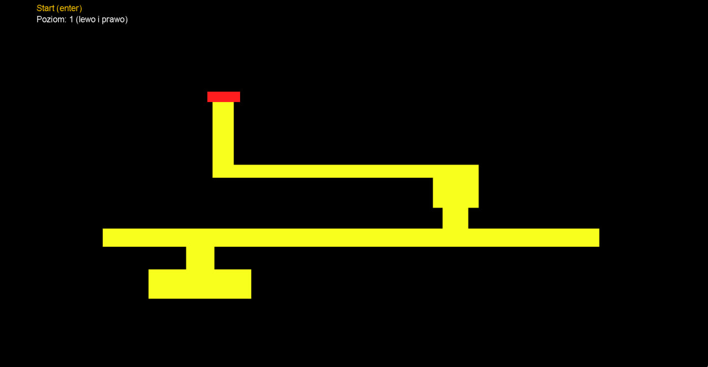
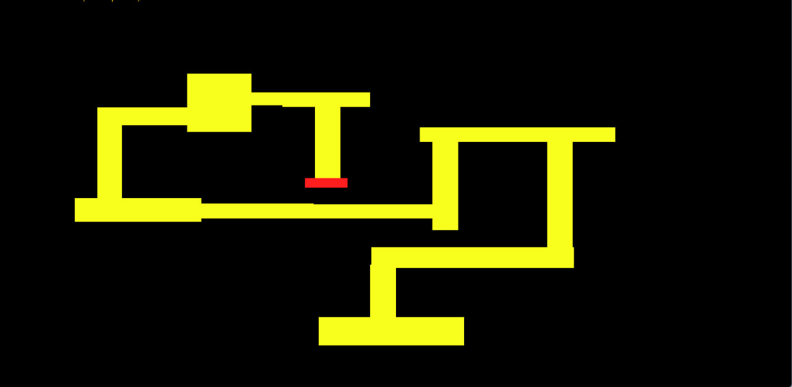
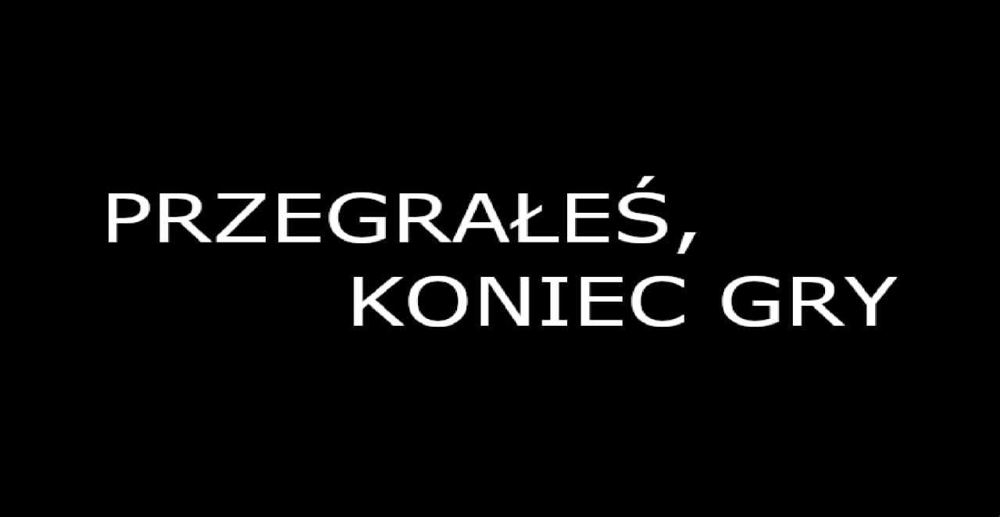

# Super Maze

## Table of Contents
* [General Info](#general-information)
* [Technologies Used](#technologies-used)
* [Features](#features)
* [Screenshots](#screenshots)
* [Usage](#usage)
* [Project Status](#project-status)

## General Information
The "Super Maze" project is a desktop application written in Java, utilizing the Swing library to create a graphical user interface. The aim of the project is to provide users with a simple, yet engaging form of digital entertainment. The game is characterized by intuitive mechanics and a user-friendly interface, making it accessible for players of all ages.

The game has been designed to be easy to learn, but offers enough challenge to keep players interested over a longer period. The project is the result of combining modern programming techniques with classic game elements, creating a unique and memorable gameplay experience.

## Technologies Used

Java ver. 21.0.2
Java is a high-level programming language known for its portability, performance, and security. In the "Super Maze" project, utilize Java version 21.0.2, which ensures access to the latest language features and performance optimizations. Java is ideal for creating desktop applications like this game, due to its strong support for object-orientation, which facilitates the management of project complexity. Additionally, its versatility allows for easy integrations with other technologies and tools.

Swing (for User Interface)
Swing is a GUI (Graphical User Interface) library that is part of the Java Foundation Classes (JFC). It is used in this project to create a responsive and intuitive user interface. Swing offers a wide range of components such as buttons, panels, labels, and menus, which are essential for building a functional and aesthetic interface. The advantage of Swing lies in its modularity and flexibility, allowing for the creation of custom components and unique GUI layouts tailored to the specific needs of this game.

Base64
Base64 is a technique for encoding binary data into ASCII character strings. This technique enables easier management and embedding of resources in source code or configuration files. Thanks to Base64, binary files are stored and transported in text form, simplifying processes such as data transfer. This technique enhances the portability and universality of the application, facilitating easier resource management and integration.

## Features
**Multi-Level Gameplay:** The game offers eight diverse levels, each with unique challenges and layouts that progressively increase in difficulty.

**Intuitive Controls:** The user can easily navigate through the game using a keyboard and mouse, providing a smooth and responsive experience.

**Dynamic Transitions Between Levels:** Upon achieving the goal on a given level, the game automatically moves the player to the next, ensuring a seamless and continuous gameplay.

**Clear Visualization of Goals and Limitations:** The blue square (player) and the red area (goal) are clearly visible, and the boundaries of the area that cannot be touched are distinctly marked in black.

**Simple, Yet Engaging Game Mechanics:** The simplicity of the rules combined with the difficulty of maneuvering creates an engaging and challenging game.

**Start Menu:** The user can easily start the game and select levels from an intuitive start menu.

## Screenshots

## Usage
1. Begin your adventure with the game.
2. Use the arrow keys to select one of the eight available levels.
3. After selecting a level, go to the menu and choose the "Start" option, then press the Enter key to start the game.
4. Your task is to guide the blue square to the red area. Use the mouse to control the square. Remember not to go into the black area, as this will result in a loss.
5. After successfully getting the blue square to the red area, the game will automatically take you to the next level, where new challenges await.

## Project Status
The project has been successfully completed.
